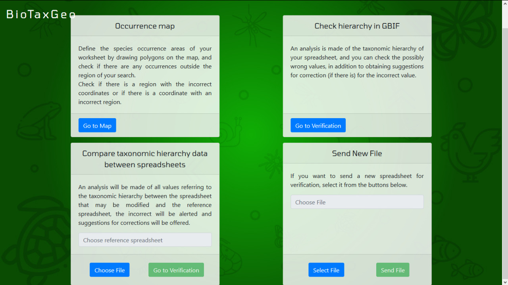
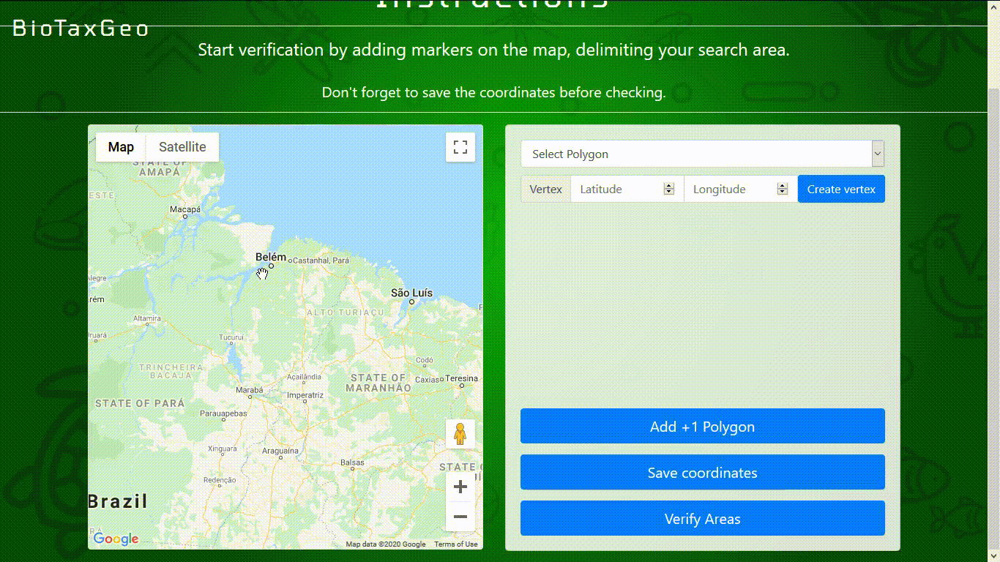

# BioTaxGeo

A quality software for taxonomic, geospatial data and occurrences of biodiversity species, which aims to help biologists and other researchers to identify and correct errors in field collection spreadsheets.

## Verification Tools

- Database Validadion
- Geographical Validation
- Comparison between Spreadsheets

## Sumary
- [BioTaxGeo](#biotaxgeo)
  - [Verification Tools](#verification-tools)
  - [Sumary](#sumary)
    - [Database Validation](#database-validation)
    - [Geographical Validation](#geographical-validation)
    - [Comparison between Spreadsheets](#comparison-between-spreadsheets)
    - [Authors](#authors)
    - [License](#license)

### Database Validation

This section will ask for you to fill the fields correctly to identify the columns in your spreadsheet file.

> After the software identify your columns, the data will be compared with a global sistem of information about biodiversity. [GBIF](https://www.gbif.org/)

> Then you will have the chance to check the suggestions, and save changes if you like.

### Geographical Validation

To validate your data for `latitude` and `longitude`, this section lets you check if you typed the right coordinates by showing in the map every entry.

> The first step is to plot pins in the map that determines a polygon

> After saving your coordinates, the map will show which entries have the correct `latitude` and `longitude` according to your spreadsheet file and the polygon you drew.

> Together with a list containing suggestions for possible incorrect entries.

> Validations will be availible at this point for modify the data in your spreadsheet file and save changes if you like.

### Comparison between Spreadsheets

This section will ask for you to fill the fields correctly to identify the columns for `two` spreadsheet files.

> After the software identify your columns, the data will be compared the entries between them.

### Authors

- Marcos Paulo Alves de Sousa
  - email: marcosp.belem@gmail.com
  - github: [marcosp-sousa](https://github.com/marcosp-sousa)
- Elielson Fernando dos Santos Barbosa
  - email: elielsonbr.com@gmail.com
  - github: [Elielson68](https://github.com/Elielson68)
- Renan Figueiredo Carneiro
  - email: renanfigcarneiro@gmail.com
  - github: [rnanc](https://github.com/rnanc)

### License

- MIT